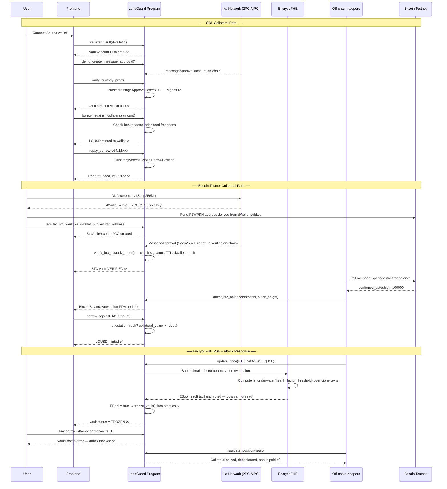
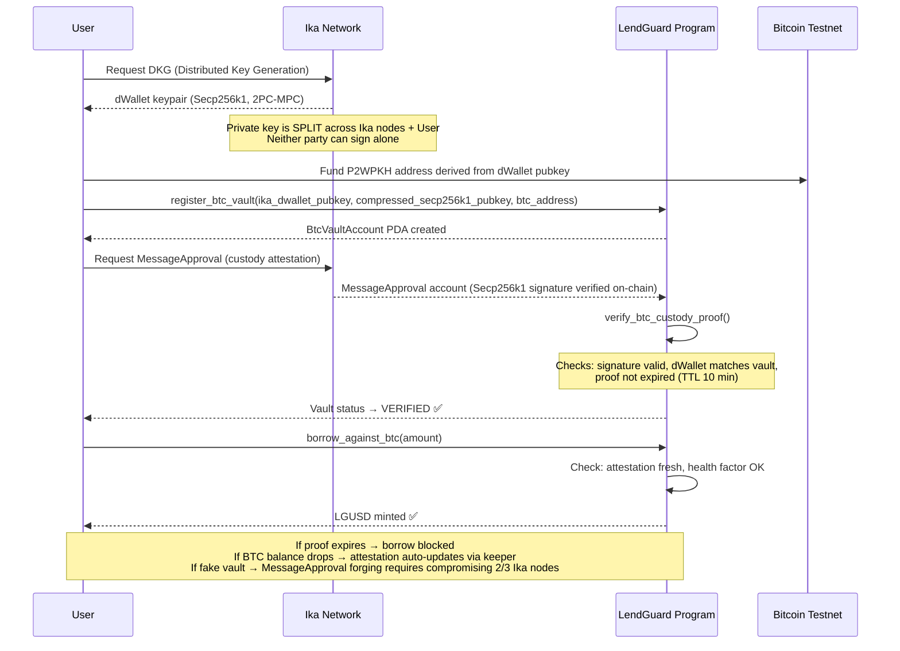
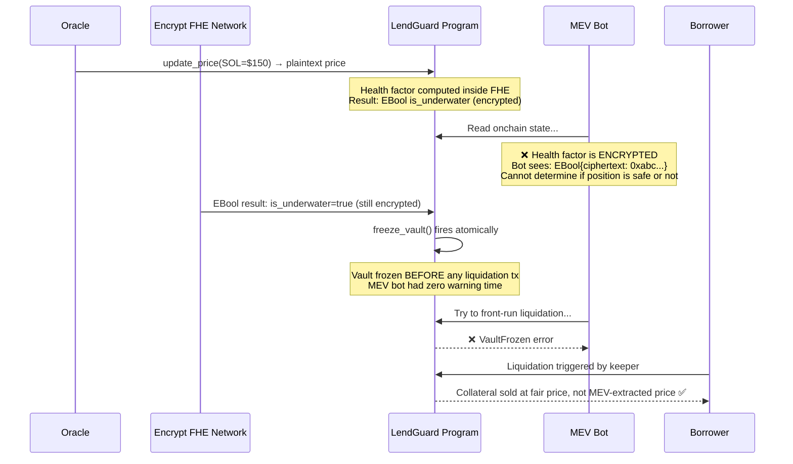
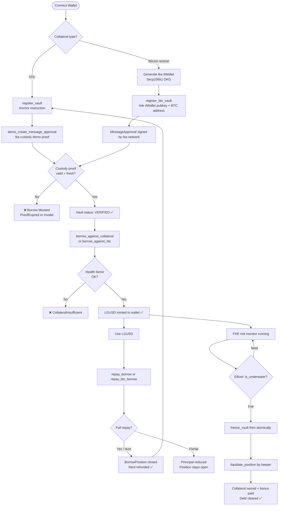

# LendGuard

> **The Solana lending protocol with cryptographically unforgeable collateral and MEV-resistant liquidations.**

[](LICENSE)
[](https://explorer.solana.com/address/GQia1ewyLgtkgX7HSfuttJ42qNPpYJhUbxeyCPXtcJFR?cluster=devnet)
[](https://www.anchor-lang.com/)
[](https://solana-pre-alpha.ika.xyz/)
[](https://docs.encrypt.xyz/)

---

## The Problem

### What happened in April 2026

On April 17, 2026, **KelpDAO was exploited for $292M**.

A compromised LayerZero validator forged a cross-chain message claiming that $292M of cross-chain collateral had been deposited. **Aave accepted it.** The protocol had no mechanism to verify whether the collateral actually existed — it trusted the bridge message blindly. By the time the oracle caught the price depeg, $190M had already been drained. The rest was frozen mid-flight.

```
Timeline:
  April 17, 2026 — Compromised LayerZero validator forges cross-chain deposit message
  April 17, 2026 — Aave accepts the forged message as valid collateral
  April 17, 2026 — Attacker borrows $190M against fake collateral
  April 17, 2026 — Oracle detects depeg, protocol paused — but too late
  April 17, 2026 — $102M additional funds frozen, unrecoverable at pause time
  ──────────────────────────────────────────────────────────────────────────
  Total loss: $292M in a single transaction sequence
```

**Root cause:** Aave, like every other DeFi lending protocol, has no contract-level proof that collateral is real. It trusts bridge messages. A single corrupted validator was enough.

### Problem 1 — Bridges are the collateral, and bridges get hacked

Every BTC, ETH, or cross-chain asset used as collateral on Solana is a **bridge IOU** — a wrapped token whose real value depends on multisig custodians staying honest. There is no smart-contract-level check that the underlying asset actually exists.

The KelpDAO incident was not an anomaly. It was the inevitable result of an architecture that has never been fixed.

### Problem 2 — Public health factors = free money for MEV bots

Every Aave-style protocol stores each position's health factor in plaintext onchain. Searchers constantly scan for positions near the liquidation boundary and front-run them:

```
Public lending:
  1. Borrower's health factor hits 1.0
  2. Searcher's bot reads it from onchain state in <100ms
  3. Searcher submits a liquidation tx with higher priority fee
  4. Borrower's collateral is sold at the worst possible price
  5. Searcher pockets the liquidation bonus
  6. Borrower loses more than they needed to

Estimated MEV drain from liquidation markets: ~$292M in 2024–2025 alone.
```

Neither problem has a contract-level fix in any existing protocol. LendGuard is that fix.

---

## The Solution

LendGuard is a Solana native lending protocol built on two new primitives:

| Layer | Technology | What it eliminates |
|---|---|---|
| **Collateral provenance** | Ika dWallets (2PC-MPC) | Bridge hacks, wrapped token risk, fake collateral |
| **Private risk monitoring** | Encrypt FHE (REFHE) | MEV front-running, liquidation sandwiching |

On top of these two layers sits a complete lending protocol: a native stablecoin (**LGUSD**), Aave-style scaled debt, permissionless liquidations, vault freeze on attack, and dust-forgiveness for clean closes.

---

## Architecture Overview



---

## How Ika dWallets Solve Collateral Provenance



### Why this is unforgeable

A traditional bridge has a multisig (e.g. 5-of-9 validators). Compromising 5 keys = total control. Ika's 2PC-MPC requires attacking a distributed threshold network where every signing ceremony uses fresh key shares. A compromised single validator cannot produce a valid `MessageApproval` — the math simply doesn't work without the network's participation.

---

## How Encrypt FHE Solves MEV-Driven Liquidations



### What's encrypted vs what's public

| Data | Visibility | Reason |
|---|---|---|
| Vault exists | **Public** | Users need to see their vaults |
| Collateral amount (SOL) | **Public** | Needed for UX display |
| Collateral amount (BTC) | **Public** | Balance attestation is onchain |
| Health factor | **Encrypted (FHE)** | Prevents MEV front-running |
| Liquidation threshold | **Encrypted (FHE)** | Prevents threshold targeting |
| `is_underwater` boolean | **Encrypted (FHE)** | Circuit result, only the program acts on it |
| LGUSD debt amount | **Public** | Borrower transparency |

---

## Comparison with Existing Lending Protocols

| Capability | LendGuard | Aave v3 | Solend | Kamino | MarginFi |
|---|---|---|---|---|---|
| BTC as collateral (no bridge) | ✅ Ika dWallet | ❌ wBTC only | ❌ Wormhole | ❌ Wormhole | ❌ Wormhole |
| ETH as collateral (no bridge) | ✅ Ika dWallet | — | ❌ Wormhole | ❌ Wormhole | ❌ Wormhole |
| Cryptographic custody proof | ✅ MessageApproval | ❌ | ❌ | ❌ | ❌ |
| Encrypted health factors | ✅ Encrypt FHE | ❌ Plaintext | ❌ Plaintext | ❌ Plaintext | ❌ Plaintext |
| MEV-resistant liquidations | ✅ Encrypted trigger | ❌ | ❌ | ❌ | ❌ |
| Atomic attack-freeze | ✅ `freeze_vault` ix | ⚠ DAO vote | ⚠ Admin pause | ⚠ Admin pause | ⚠ Admin pause |
| Fake collateral rejection | ✅ On-chain proof check | ❌ Oracle trust | ❌ Oracle trust | ❌ Oracle trust | ❌ Oracle trust |
| Native stablecoin | ✅ LGUSD (SPL) | ❌ GHO (ETH only) | ❌ | ⚠ kUSD | ❌ |
| Bridge dependency | **Zero** | Many | Many | Many | Many |
| Dust forgiveness on repay | ✅ Auto-close | ❌ | ❌ | ❌ | ❌ |

---

## Full User Journey



---

## What Is Live Today

| Component | Status | Notes |
|---|---|---|
| Anchor program (11+ instructions) | ✅ Deployed | Devnet `GQia1ewyLgtkgX7HSfuttJ42qNPpYJhUbxeyCPXtcJFR` |
| SOL collateral vaults | ✅ Live | `register_vault` + `verify_custody_proof` |
| Bitcoin testnet collateral | ✅ Live | `register_btc_vault` + Ika Secp256k1 path |
| LGUSD SPL token | ✅ Live | Program-controlled mint |
| Borrow / repay / liquidate | ✅ Live | Aave-style scaled debt, dust forgiveness |
| Ika MessageApproval parsing | ✅ Real | Auto-detects real Ika format + demo-helper fallback |
| Encrypt FHE risk pipeline | ✅ Off-chain | On-chain EBool CPI wired; pre-alpha gates lift in next upgrade |
| BTC balance keeper | ✅ Running | Polls `mempool.space/testnet`, posts `BitcoinBalanceAttestation` |
| Price refresh daemon | ✅ Running | BTC=$90k, ETH=$3.5k, SOL=$150 refreshed every 10 min |
| Next.js frontend | ✅ Live | `/lend` (protocol) + `/demo` (attack simulations) |
| Torque growth layer | ✅ Live | 8 custom events, biweekly leaderboard (1,500 SOL), BTC bonus pool (500 SOL) |
| `@lendguard/sdk` | ✅ Published | npm `@lendguard/sdk` |

---

## Project Structure

```
LendGuard/
├── contracts/                     Anchor 1.x program (Rust)
│   ├── src/
│   │   ├── lib.rs                 Program entrypoint, all instructions
│   │   ├── instructions/
│   │   │   ├── lending.rs         borrow, repay, liquidate
│   │   │   ├── btc_lending.rs     btc-specific borrow/repay
│   │   │   ├── register_vault.rs
│   │   │   ├── verify_custody_proof.rs
│   │   │   ├── verify_btc_custody_proof.rs
│   │   │   ├── register_btc_vault.rs
│   │   │   ├── attest_btc_balance.rs
│   │   │   └── freeze_vault.rs
│   │   ├── integrations/
│   │   │   ├── ika.rs             MessageApproval parser (real + demo)
│   │   │   └── encrypt.rs         EBool result reader
│   │   └── state/                 On-chain account structs
│   └── scripts/
│       ├── refresh-prices.mjs     Price feed daemon
│       ├── btc-balance-keeper.mjs Bitcoin testnet attestation keeper
│       └── btc-liquidation-broadcaster.mjs
├── web/                           Next.js 16 frontend
│   ├── app/
│   │   ├── lend/page.tsx          Full lending protocol UI
│   │   ├── demo/page.tsx          Attack simulation demos
│   │   └── api/torque/events/     Server-side Torque event proxy
│   └── lib/
│       ├── program-actions.ts     All instruction builders
│       ├── lending-client.ts      Account fetchers + math
│       ├── btc-dwallet.ts         Ika Secp256k1 dWallet generation
│       ├── torque-client.ts       Torque event emission
│       └── torque-events.ts       Event schema registry
├── packages/sdk/                  @lendguard/sdk (TypeScript)
└── docs/
    ├── HANDOFF.md                 Full technical handoff
    ├── PRODUCTION_OPS.md          Keeper runbook
    └── BTC_COLLATERAL_PATH.md     Bitcoin integration design
```

---

## Running Locally

### Prerequisites

```bash
# Rust + Solana CLI + Anchor 1.x
rustup install stable
sh -c "$(curl -sSfL https://release.solana.com/v2.1.0/install)"
cargo install --git https://github.com/coral-xyz/anchor anchor-cli --locked

# Node.js 20+
node --version  # must be >= 20
```

### 1. Clone and install

```bash
git clone https://github.com/Rohitamalraj/LendGuard.git
cd LendGuard
cd web && npm install && cd ..
```

### 2. Configure environment

```bash
cp .env.example web/.env.local
# Add TORQUE_API_KEY for growth events (optional for local dev)
```

### 3. Start the frontend

```bash
cd web
npm run dev
# → http://localhost:3000
```

### 4. Run the background keepers (optional, for live BTC attestation)

```bash
# In separate terminals:
node contracts/scripts/refresh-prices.mjs          # price feed daemon
node contracts/scripts/btc-balance-keeper.mjs       # BTC balance attestation
```

### 5. Connect a Solana devnet wallet

- Install [Phantom](https://phantom.app/) or any Solana wallet.
- Switch to **Devnet** in wallet settings (Developer Settings → Testnet Mode → Solana Devnet).
- Airdrop SOL: `solana airdrop 2 <your-address> --url devnet`.
- Navigate to `/lend` and register a vault.

---

## Devnet Addresses

| Resource | Address |
|---|---|
| LendGuard Program | `GQia1ewyLgtkgX7HSfuttJ42qNPpYJhUbxeyCPXtcJFR` |
| LGUSD Mint | see `web/lib/program-actions.ts → LGUSD_MINT` |
| Ika Program | `87W54kGYFQ1rgWqMeu4XTPHWXWmXSQCcjm8vCTfiq1oY` |
| Encrypt Program | `4ebfzWdKnrnGseuQpezXdG8yCdHqwQ1SSBHD3bWArND8` |
| Ika gRPC | `pre-alpha-dev-1.ika.ika-network.net:443` |
| Encrypt gRPC | `pre-alpha-dev-1.encrypt.ika-network.net:443` |

---

## SDK

```bash
npm install @lendguard/sdk
```

```typescript
import { LendGuard } from "@lendguard/sdk";

const lg = new LendGuard({ connection, wallet, cluster: "devnet" });

// Register a vault and verify Ika custody proof
const { vaultPda } = await lg.registerVault({ dwalletId });
await lg.verifyCustodyProof({ vaultPda, messageApproval });

// Borrow LGUSD against verified collateral
await lg.borrow({ vaultPda, amountLgusd: 25_000_000n }); // 25 LGUSD (6 decimals)

// Repay in full — position closes automatically, rent refunded
await lg.repayAll({ vaultPda });
```

---

## Built For

**Solana Frontier Hackathon 2026 — Encrypt & Ika track**

- [Ika documentation](https://solana-pre-alpha.ika.xyz/)
- [Encrypt documentation](https://docs.encrypt.xyz/)
- [Torque MCP](https://platform.torque.so/)

---

## License

MIT
